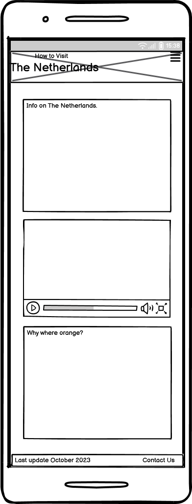
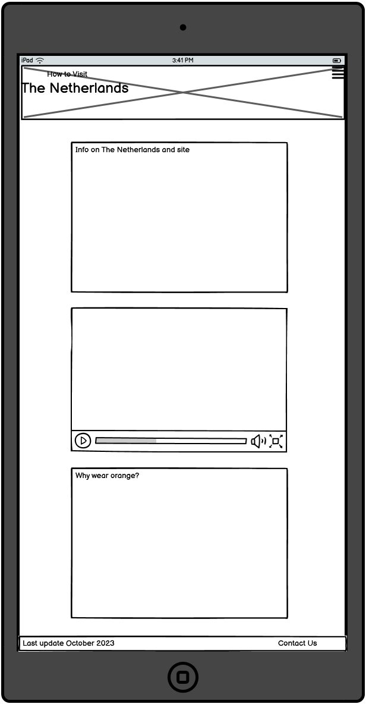
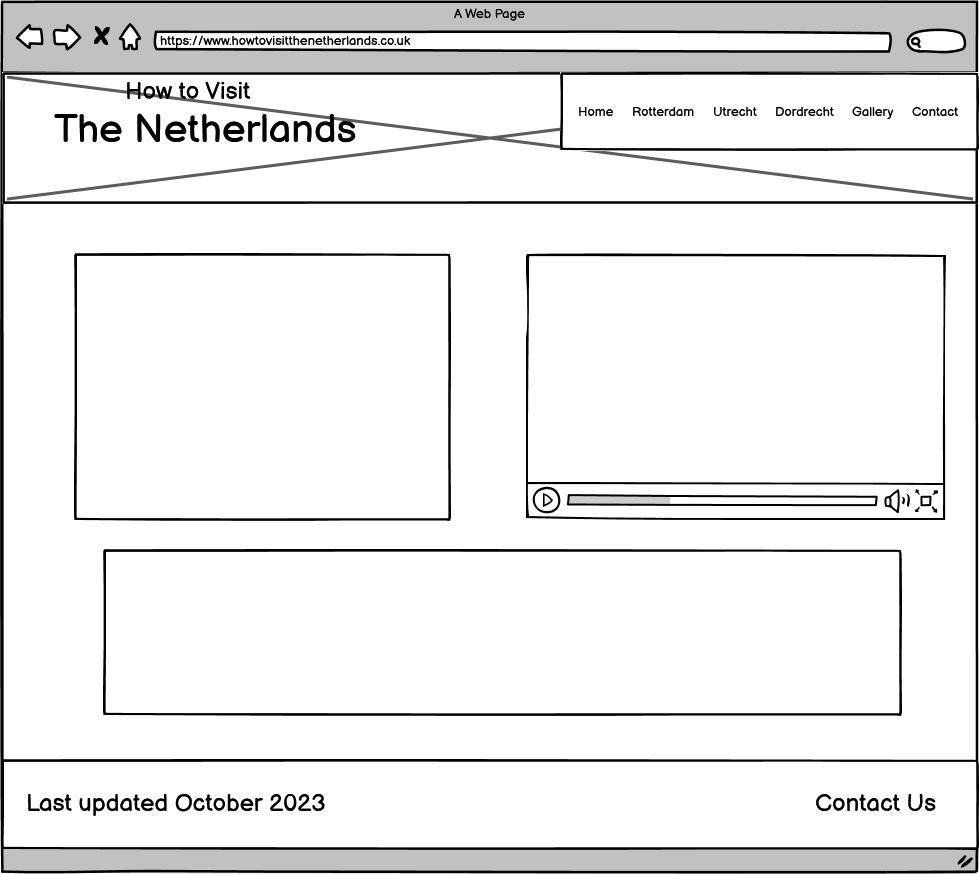

# How to Vist The Netherlands Website
---

[View the live project here](https://debbiepotts87.github.io/how-to-visit-the-netherlands/rotterdam.html)

This is a tourist website for The Netherlands that follows an uncommon theme. The majority of websites in this genre follow the same theme and types of places to visit, this website is designed to think out of the box, provide information that is otherwise hard to find all in one site and provide visitors the opportunity to give their opinions and recommendations to contribute to the website themselves. It has been designed using the Bootstrap 5 framework to help it be responsive on a range of devices.

## Tablet of Content

1. [User Experience](#user-experience)
    1. [User Stories](#user-stories)
    2. [5 Planes of UX Design](#5-planes-of-ux-design)
        1. [Strategy](#strategy)
        2. [Scope](#scope)
        3. [Structure](#structure)
        4. [Skeleton](#skeleton)
        5. [Surface](#surface)
    3. [Design](#design)
    4. [Wireframes](#wireframes)
2. [Features](#features)
3. [Technology Used](#technology-used)
    1. [Languages Used](#languages-used)
     2. [Frameworks, Libraries & Programs Used](#frameworks-libraries--programs-used)
4. [Testing](#testing)
    1. [W3C Validators](#w3c-validators)
    2. [Google Dev Tools](#google-dev-tools)
    3. [Wave](#wave)
    4. [Lighthouse](#lighthouse)
    5. [Functional Testing](#functional-testing)
    6. [Devices used to test](#devices-used-to-test)
    7. [Testing User Stories from User Experience (UX)](#testing-user-stories-from-user-experience-ux)
5. [Bugs](#bugs)
    1. [Known Bugs](#known-bugs)
    2. [Fixed Bugs](#fixed-bugs)
6. [Deployment](#deployment)
    1. [Github Pages](#github-pages)
    2. [Making a Local Clone](#making-a-local-clone)
7. [Credits](#credits)
    1. [Code](#code)
    2. [Content](#content)
    3. [Media](#media)
    4. [Acknowledgements](#acknowledgements)

# User Experience (UX)

## User Stories
* First-Time Visitor Goals
    1. As a first-time user, I would like to gain basic knowledge of country
    2. As a first-time user, I want to easily navigate through the website and gain information on cities I may not have heard of
    3. As a first-time user, I would like a selection of different activities to choose from in each city
    4. As a first-time user, I would like an easy-to-follow map

* Returning Visitor Goals
    1. As a returning visitor, I would like to find addressed and information on attractions and activities quickly and smoothly
    2. As a returning user, I would like to use the city maps to navigate and find places in the city
    3. As a returning user, I would like to provide feedback, suggestions and give recommendations
    4. As a returning user, I would like to see new cities and information added in future updates

* Frequent User Goals
    1. As a frequent user, I would like to use the city maps to navigate the city
    2. As a frequent user, I would like to see new cities and activities in future updates
    3. As a frequent user, I would like to provide feedback, suggestions and recommendations

## 5 Planes of UX Design

### Strategy
* What problem the project intends to solve.
    * Users looking for information on activities and places to eat in The Netherlands are provided with hundreds of websites however, these websites all contain the same information. To find multiple activities that are not the same the user would have to use multiple sites. This website aims to break out of the typical theme for a tourist site for The Netherlands and provide out-of-the-box places to visit, eat and special events.
    * User needs.
        * Somewhere to eat
        * Somewhere to visit that isn't a well known tourist attraction
        * An event to visit that isn't widely known about
        * Map to help with navigation
        * Media (Images and/or videos) to provide visual information
    * Business needs.
        * Feedback on the places listed on the site
        * Hear from users on new places to visit/research for future updates
        * Link to external sites such as restaurants, once foot traffic is up reach out and offer honest, paid reviews
    * Target audience.Travelers and backpackers
        * Weekend breaks
    * Why our site?
        * Fewer tourist attractions and more seeing the real country. Other well-known sites only provide information on major          attractions which are normally more expensive and busy
    
    #### Viability and Feasibility
    | Task                         | Importance | Viability/Feasibility |
    |------------------------------|:----------:|:---------------------:|
    | Tourist videos for each city | 3          | 3                     |
    | What to eat section          | 5          | 5                     |
    | Where to visit section       | 5          | 5                     |
    | What not to miss section     | 5          | 5                     |
    | Gallery for each city        | 4          | 4                     |
    | Google map for each city     | 5          | 5                     |
    | Social media links           | 3          | 5                     |
    | Links to attractions         | 5          | 5                     |
    | Feedback form                | 4          | 5                     |

### Scope

| Whats in                 | Whats out/for future updates          | Whats altered          |
|--------------------------|---------------------------------------|------------------------|
| What to eat section      | Gallery for each city (altered)       | Dedicated gallery page |
| Where to visit section   | Tourist videos for each city (altered)| 1 cinematic video      |
| What not to miss section |
| Google map for each city |
| Social media links       |
| Links to attractions     |
| Feedback form            |

* Next update
    * Feedback and reviews section
    * 2 more cities
    * Add the 2 new cities to the gallery page

* Following update
    * 2 more cities with all features
The end goal for this website is to feature information on a total of eight cities. They will have all of the currently implemented features along with new features such as travel information and hotel reviews.
Further down the line, there is the option to branch out and provide information on other countries using the branding 'How to Visit.'

* [Jira](https://www.atlassian.com/software/jira) was used during this planning process to plan a sprint. You can see how I planned it [here](assets/doumentation/sprint.png)

### Structure

* Information Architecture (IA)
    * A tree structure was used for the navigation to make moving around the page easier for the user.
    * Information is laid out in outlined sections with their own headers to make sections and information quick to locate
    * Information is placed above Google-maps so that it is not missed by the user
* Interactive Experience
    * Controls on all videos on the website
    * Carousels used for the gallery page for positive typography
    * contact.html reset and submit buttons to change colour on hover to help the user visually

### Skeleton

[Balsamiq](https://balsamiq.com/) was used during this section to create wireframes
* All city pages follow the same layout. This will make it easier for the user when navigating through the pages
* The homepage is to be clear and concise. A Youtube video will be embedded, it must be high quality and lighthouse used to check the performance levels once implemented
* Keep the text informative but informal to keep the user interested
* Provide information on future updates to make the user want to come back
* Value on each city page from:
    * Information on all 3 activities
    * A map of each city
    * Ample whitespace to keep the page clean and easy for the user to navigate information
* Use progressive disclosure by each city having its own page and images relating to the cities located in a 'gallery' page
* Pages and information on pages will be visually grouped in order of importance
    1. Landing page is the home page
    2. Navigation bar layout
        * Cities with their own button and located after the home page button
        * Gallery page is located after all three cities
        * Contact us page located last - This is the most common place to find this section
        * A search bar and/or filters are not required. Once the site has experienced future updates and includes more cities this may be required.
* Visual metaphors are to be used throughout. 
    * Font Awesome will be used on links and form sections
        * Globe icon for external links
        * Social media icons in the footer instead of text. This is quicker for the user and more visually pleasing
        * Envelope icon in the footer that links to the contact page
        * Person icon used in the form for the 'About You' section
        * Globe icon used in the form for the 'Where you visited' section
    * Information design on the contact form
        * Select menu for age groups instead of radio buttons to prevent too much information from being on show
        * Select menu for the country visited instead of radio buttons. This is to prevent the user from being presented with too much information and also to make it easier to add future cities to the selection options

### Surface

* Colour scheme.
    * With the colour orange being so significant to The Netherlands this colour was used for the header and footer.
    * A grey colour was used for the background, this is both visually pleasing and also makes the site accessible for those who like to use features such as dark mode which is not implemented on this site.

* Readibility
    * Roboto Condensed was imported from Google Fonts to provide a legible yet modern font. A fallback on Sans-serif was also used.
    * An off-white colour is used for the font to make it both clear and kinder on the user's eyes compared to using white.
    * Containers are evenly spaced and provide ample white space so that the user does not feel overloaded by information.

* ## Design
    * Colour Scheme
        * The main colour theme is orange, which is the Dutch colour. I used [HTML Color Codes](https://htmlcolorcodes.com/) to create a shade of orange which is user-friendly but also sticks to the theme
    * Typography
        * The font used for the site was imported from Google Fonts. I chose Roboto Condensed for a modern, easy-to-read style with Sans-serif as a fallback.
    * Imagery
        * Imagery has been kept minimal on the informative pages to save distraction from the information. To support the information provided on the website a gallery page has been provided.

* ## Wireframes

Wireframes were created using [Balsamiq](https://balsamiq.com/)

    
Mobile Wireframe

**[Full mobile PDF wireframe collection](assets/doumentation/mobile-wireframe-collection.pdf)**

 

    
Tablet Wireframe

**[Full tablet PDF wireframe collection](assets/doumentation/tablet-wireframe-collection.pdf)**

 

    
Desktop Wireframe

**[Full desktop PDF wireframe collection](assets/doumentation/desktop-wireframe-collection.pdf)**

 

---
# Features

* Responsive on all devices
* Hamburg menu for mobile and tablet-sized screens
* Carousels on the gallery page to appear less cluttered to contain a useful amount of content
* Contact form submit button turns green on hover and the reset button turns red on hover to make them more user-friendly
* Links to recommended venues and events
* Google maps embedded in the site
* Contact form submit page containing information on the next update to keep users coming back
* Custom 404 page to make navigation easier for users

---
# Technology Used

## Languages Used
[HTML5](https://en.wikipedia.org/wiki/HTML5)

[CSS3](https://en.wikipedia.org/wiki/CSS)

## Frameworks, Libraries & Programs Used
1. [Visual Studio Code](https://code.visualstudio.com/)
    * Visual Studio Code was used to compile the code to complete the website.
2. [Balsamiq](https://balsamiq.com/)
    * Balsamiq was used during the design process to create the Wireframes
3. [Jira](https://www.atlassian.com/software/jira)
    * Jira was used to create a sprint to aid the development of the project
3. [Git](https://git-scm.com/)
    * Git was used for version control
4. [Github](https://github.com/)
    * Github is used to store the code
5. [Bootstrap 5.3](https://getbootstrap.com/)
    * Bootstrap was used to assist with the styling and responsiveness of the site
6. [Font Awesome](https://fontawesome.com/icons)
    * Font Awesome was used to add styling to the site through icons
7. [Chrome Dev Tools](https://developer.chrome.com/docs/devtools/)
    * Chrome Dev Tools was used to debug minor issues and as an aid when styling the website
8. [Hex Color Codes](https://htmlcolorcodes.com/)
    * Used to provide color codes for the website
9. [Google Fonts](https://fonts.google.com/)
    * Used for the typography for a modern but easy-to-read design
10. [RGBA Color Picker](https://rgbacolorpicker.com/)
    * RGBA Color Picker was used to convert the orange hex code to allow me to change the opacity of the header and footer
11. [Favicon](https://favicon.io/)
    * Used for the website favicon

---
# Testing
Testing was carried out throughout the project with the use of both [Google DevTools](https://developer.chrome.com/docs/devtools) and by watching live changes using [Visual Studio Code Live Server extension](https://marketplace.visualstudio.com/items?itemName=ms-vscode.live-server)

### W3C Validators
The W3C Markup Validator and the W3C CSS Validator were used to validate the code and ensure that there were no syntax errors in the project. No errors were found.

* [W3C Markup Validator](https://validator.w3.org/)
* [W3C CSS Validator](https://validator.w3.org/)

### Google Dev Tools
* Google Dev Tools was used to check responsive design
    * Form input was not responsive
        * [W3 Schools](https://www.w3schools.com/howto/howto_css_responsive_form.asp) guide was used to fix this

### Wave
* [Wave](https://wave.webaim.org/report#/https://debbiepotts87.github.io/how-to-visit-the-netherlands/index.html) was used to test the website for any errors.
    * Homepage
        * 0 Errors
        * 0 Contrast Errors
    * Rotterdam
        * 0 Errors
        * 0 Contrast Errors
    * Utrecht
        * 0 Errors
        * 0 Contrast Errors
    * Dordretcht
        * 0 Errors
        * 0 Contrast Errors
    * Contact
        * 0 Errors
        * 0 Contrast Errors
    * Submit
        * 0 Errors
        * 0 Contrast Errors
    * 404
        * 0 Errors
        * 0 Contrast Errors

### Lighthouse
[Lighthouse](https://developer.chrome.com/docs/lighthouse/overview/) was used to check the performance

    
index.html

 

     
Mobile

* 98 performance
* 90 Accessibility
* 95 Best Practices
* 100 SEO

 
 

     
Desktop

* 98 performance
* 100 Accessibility
* 95 Best Practices
* 100 SEO

 

    
rotterdam.html

 

     
Mobile

* 98 performance
* 90 Accessibility
* 95 Best Practices
* 100 SEO

 
 

     
Desktop

* 98 performance
* 100 Accessibility
* 95 Best Practices
* 100 SEO

 

    
utrecht.html

 

     
Mobile

* 98 performance
* 90 Accessibility
* 95 Best Practices
* 100 SEO

 
 

     
Desktop

* 98 performance
* 100 Accessibility
* 95 Best Practices
* 100 SEO

 

    
dordretcht.html

 

     
Mobile

* 98 performance
* 90 Accessibility
* 95 Best Practices
* 100 SEO

 
 

     
Desktop

* 98 performance
* 100 Accessibility
* 95 Best Practices
* 100 SEO

 

    
gallery.html

 

     
Mobile

* 73 performance
* 92 Accessibility
* 100 Best Practices
* 100 SEO

 
 

     
Desktop

* 80 performance
* 100 Accessibility
* 100 Best Practices
* 100 SEO

 

    
contact.html

 

     
Mobile

* 97 performance
* 100 Accessibility
* 100 Best Practices
* 100 SEO

 
 

     
Desktop

* 100 performance
* 100 Accessibility
* 100 Best Practices
* 100 SEO

 

    
submit.html

 

     
Mobile

* 98 performance
* 91 Accessibility
* 100 Best Practices
* 96 SEO

 
 

     
Desktop

* 98 performance
* 100 Accessibility
* 100 Best Practices
* 96 SEO

 

    
404.html

 

     
Mobile

* 97 performance
* 100 Accessibility
* 100 Best Practices
* 95 SEO

 
 

     
Desktop

* 98 performance
* 100 Accessibility
* 100 Best Practices
* 100 SEO

### Devices used to test
* Desktop/Laptop
     * 16" laptop
    * 32" widescreen monitor

 * Tablet Devices
     * Samsung Galaxy Tab S6
     * Samsung Galaxy Tab A8
     * ipad Air

 * Mobile Devices
     * Samsung Galaxy S21FE
     * Samsung Galaxy S23 Ultra

### Functional Testing

    
On Page Load

| Action                                           | Expected                                | Result                            |
| -------------------------------------------------|-----------------------------------------|-----------------------------------|
| Load page from URL                               | Page to load                            | Page loads                        |

 

    
index.html

| Action                                           | Expected                                 | Result                               |
| -------------------------------------------------|------------------------------------------|--------------------------------------|
| Load page                                        | Page to load                             | Page loads                           |
| On page load                                     | Youtube video remains paused             | Youtube video remains paused         |
| Click play button on Youtube video               | Video to play with all controls working  | Video plays and all controls work    |
| Click link to Youtube channel                    | Youtube channel loads in new page        | Youtube channel loads in new page    |
| Click Netherlands Insiders in Why Orange Section | Page opens in new window                 | Page opens in new window             |
| Click Dutch Amsterdam in Why Orange section      | Page opens in new window                 | Page opens in new window             |
| Click Rotterdam in nav bar                       | Rotterdam page loads                     | Rotterdam page loads as expected     |
| Click Utrecht in nav bar                         | Utrecht page loads                       | Utrecht page loads as expected       |
| Click Dordrecht in nav bar                       | Dordrecht page loads                     | Dordrecht page loads as expected     |
| Click Contact in the nav bar                     | Contact page to load                     | Contact us page loads                |
| Click Gallery in the nav bar                     | Gallery page to load                     | Gallery page loads                   |
| Click the envelope icon in the footer            | Redirects to contact page                | Redirects to contact page            |
| Click on the Facebook icon links in footer       | Redirects to Facebook in a new page      | Redirects to Facebook in a new page  |
| Click on the Twitter icon links in footer        | Redirects to Twitter in a new page       | Redirects to Twitter in a new page   |
| Click on the Instagram icon links in footer      | Redirects to Instagram in a new page     | Redirects to Instagram in a new page |

  
 

    
rotterdam.html

| Action                                             | Expected                                 | Result                               |
| ---------------------------------------------------|------------------------------------------|--------------------------------------|
| Load page                                          | Page to load                             | Page loads                           |
| Click Dionysos in where to eat section             | Page opens in new window                 | Page opens in new window             |
| Click Baroeg Open Air in what not to miss section  | Page opens in new window                 | Page opens in new window             |
| Click Willemswerf in where to visit section        | Page opens in new window                 | Page opens in new window             |
| Use Google map controls                            | Zoom in, out, click and drag to navigate | Zoom in, out, click and drag to navigate |
| Click view larger map on Google maps               | Opens map in new page                    | Opens map in new page                |
| Click Home in nav bar                              | Home page loads                          | Home page loads as expected          |
| Click Utrecht in nav bar                           | Utrecht page loads                       | Utrecht page loads as expected       |
| Click Dordrecht in nav bar                         | Dordrecht page loads                     | Dordrecht page loads as expected     |
| Click Gallery in nav bar                           | Gallery page loads                       | Gallery page loads as expected       |
| Click Contact in the nav bar                       | Contact page to load                     | Contact us page loads                |
| Click the envelope icon in the footer              | Redirects to contact page                | Redirects to contact page            |
| Click on the Facebook icon links in footer         | Redirects to Facebook in a new page      | Redirects to Facebook in a new page  |
| Click on the Twitter icon links in footer          | Redirects to Twitter in a new page       | Redirects to Twitter in a new page   |
| Click on the Instagram icon links in footer        | Redirects to Instagram in a new page     | Redirects to Instagram in a new page |

  
 

    
utrecht.html

| Action                                             | Expected                                 | Result                               |
| ---------------------------------------------------|------------------------------------------|--------------------------------------|
| Load page                                          | Page to load                             | Page loads                           |
| Click Hofman in where to eat section               | Page opens in new window                 | Page opens in new window             |
| Click Winter Market in what not to miss section    | Page opens in new window                 | Page opens in new window             |
| Click Dom Tower in where to visit section          | Page opens in new window                 | Page opens in new window             |
| Use Google map controls                            | Zoom in, out, click and drag to navigate | Zoom in, out, click and drag to navigate |
| Click view larger map on Google maps               | Opens map in new page                    | Opens map in new page                |
| Click Home in nav bar                              | Home page loads                          | Home page loads as expected          |
| Click Rotterdam in nav bar                         | Rotterdam page loads                     | Rotterdam page loads as expected     |
| Click Dordrecht in nav bar                         | Dordrecht page loads                     | Dordrecht page loads as expected     |
| Click Gallery in nav bar                           | Gallery page loads                       | Gallery page loads as expected       |
| Click Contact in the nav bar                       | Contact page to load                     | Contact us page loads                |
| Click the envelope icon in the footer              | Redirects to contact page                | Redirects to contact page            |
| Click on the Facebook icon links in footer         | Redirects to Facebook in a new page      | Redirects to Facebook in a new page  |
| Click on the Twitter icon links in footer          | Redirects to Twitter in a new page       | Redirects to Twitter in a new page   |
| Click on the Instagram icon links in footer        | Redirects to Instagram in a new page     | Redirects to Instagram in a new page |

  
 

    
dordrecht.html

| Action                                             | Expected                                 | Result                               |
| ---------------------------------------------------|------------------------------------------|--------------------------------------|
| Load page                                          | Page to load                             | Page loads                           |
| Click La Cubanita in where to eat section          | Page opens in new window                 | Page opens in new window             |
| Click Dordtevaar in what not to miss section       | Page opens in new window                 | Page opens in new window             |
| Click Grote Kerk in where to visit section         | Page opens in new window                 | Page opens in new window             |
| Use Google map controls                            | Zoom in, out, click and drag to navigate | Zoom in, out, click and drag to navigate |
| Click view larger map on Google maps               | Opens map in new page                    | Opens map in new page                |
| Click Home in nav bar                              | Home page loads                          | Home page loads as expected          |
| Click Rotterdam in nav bar                         | Rotterdam page loads                     | Rotterdam page loads as expected     |
| Click Utrecht in nav bar                           | Utrecht page loads                       | Utrecht page loads as expected       |
| Click Gallery in nav bar                           | Gallery page loads                       | Gallery page loads as expected       |
| Click Contact in the nav bar                       | Contact page to load                     | Contact us page loads                |
| Click the envelope icon in the footer              | Redirects to contact page                | Redirects to contact page            |
| Click on the Facebook icon links in footer         | Redirects to Facebook in a new page      | Redirects to Facebook in a new page  |
| Click on the Twitter icon links in footer          | Redirects to Twitter in a new page       | Redirects to Twitter in a new page   |
| Click on the Instagram icon links in footer        | Redirects to Instagram in a new page     | Redirects to Instagram in a new page |

  
 

    
gallery.html

| Action                                             | Expected                                 | Result                               |
| ---------------------------------------------------|------------------------------------------|--------------------------------------|
| Load page                                          | Page to load                             | Page loads                           |
| Click Home in nav bar                              | Home page loads                          | Home page loads as expected          |
| Click Rotterdam in nav bar                         | Rotterdam page loads                     | Rotterdam page loads as expected     |
| Click Utrecht in nav bar                           | Utrecht page loads                       | Utrecht page loads as expected       |
| Click Dordrecht in nav bar                         | Dordrecht page loads                     | Dordrecht page loads as expected     |
| Click Contact in the nav bar                       | Contact page to load                     | Contact us page loads                |
| Click right and left arrows on rotterdam gallery   | Images switch between the three          | Images switch smoothly between the three |
| Click right and left arrows on utrecht gallery     | Images switch between the three          | Images switch smoothly between the three |
| Click right and left arrows on dordrecht gallery   | Images switch between the three          | Images switch smoothly between the three |
| Click the envelope icon in the footer              | Redirects to contact page                | Redirects to contact page            |
| Click on the Facebook icon links in footer         | Redirects to Facebook in a new page      | Redirects to Facebook in a new page  |
| Click on the Twitter icon links in footer          | Redirects to Twitter in a new page       | Redirects to Twitter in a new page   |
| Click on the Instagram icon links in footer        | Redirects to Instagram in a new page     | Redirects to Instagram in a new page |

  
 

    
contact.html

### Page Functions
| Action                                             | Expected                                 | Result                               |
| ---------------------------------------------------|------------------------------------------|--------------------------------------|
| Load page                                          | Page to load                             | Page loads                           |
| Click Home in nav bar                              | Home page loads                          | Home page loads as expected          |
| Click Rotterdam in nav bar                         | Rotterdam page loads                     | Rotterdam page loads as expected     |
| Click Utrecht in nav bar                           | Utrecht page loads                       | Utrecht page loads as expected       |
| Click Dordrecht in nav bar                         | Dordrecht page loads                     | Dordrecht page loads as expected     |
| Click Gallery in the nav bar                       | Gallery page to load                     | Gallery page loads                   |
| Click the envelope icon in the footer              | Redirects to contact page                | Redirects to contact page            |
| Click on the Facebook icon links in footer         | Redirects to Facebook in a new page      | Redirects to Facebook in a new page  |
| Click on the Twitter icon links in footer          | Redirects to Twitter in a new page       | Redirects to Twitter in a new page   |
| Click on the Instagram icon links in footer        | Redirects to Instagram in a new page     | Redirects to Instagram in a new page |

### Form Functions
**When boxes are filled in:**
| Action                                    | Expected                                    | Result                                     |
| ------------------------------------------|---------------------------------------------|--------------------------------------------|
| First name                                | Box filled and allows to submit             | Box filled and allows to submit            |
| Last name                                 | Box filled and allows to submit             | Box filled and allows to submit            |
| Email                                     | Box filled and allows to submit             | Box filled and allows to submit            |
| Age Group                                 | Drop down menu works and allows to submit   | Drop down menu works and allows to submit  |
| City visited                              | Drop down menu works and allows to submit   | Drop down menu works and allows to submit  |
| Date visited                              | Calendar works and allows to submit         | Calendar works and allows to submit        |
| About your experience                     | Box filled and allows to submit             | Box filled and allows to submit            |
| Hover over reset button                   | Reset button turns red                      | Reset button turns red                     |
| Hover over submit button                  | Submit button turns green                   | Submit button turns green                  |
| Click reset button                        | Resets form                                 | Form resets                                |
| Click submit button                       | Form submits and redirects to submit.html   | Form submits and redirects to submit.html  |

**On clicking submit when boxes are not filled in:**
| Action                                    | Expected                                 | Result                                     |
| ------------------------------------------|------------------------------------------|--------------------------------------------|
| First name                                | Error message shows                      | Page scrolls up, this clears error message |
| Last name                                 | Error message shows                      | Page scrolls up, this clears error message |
| Email                                     | Error message shows                      | Error message shows                        |
| Age Group                                 | Error message shows                      | Error message shows                        |
| City visited                              | Error message shows                      | Error message shows                        |
| Date visited                              | Error message shows                      | Error message shows                        |
| About your experience                     | Error message shows                      | Error message shows                        |

  
 

    
submit.html

| Action                                             | Expected                                 | Result                               |
| ---------------------------------------------------|------------------------------------------|--------------------------------------|
| Load page                                          | Page to load                             | Page loads                           |
| Click Home in nav bar                              | Home page loads                          | Home page loads as expected          |
| Click Rotterdam in nav bar                         | Rotterdam page loads                     | Rotterdam page loads as expected     |
| Click Utrecht in nav bar                           | Utrecht page loads                       | Utrecht page loads as expected       |
| Click Dordrecht in nav bar                         | Dordrecht page loads                     | Dordrecht page loads as expected     |
| Click Gallery in the nav bar                       | Gallery page to load                     | Gallery page loads                   |
| Click Contact in the nav bar                       | Contact page to load                     | Contact us page loads                |
| Click Home button                                  | Home page to load                        | Home page loads                      |
| Click Gallery button                               | Gallery page to load                     | Gallery page loads                   |
| Click the envelope icon in the footer              | Redirects to contact page                | Redirects to contact page            |
| Click on the Facebook icon links in footer         | Redirects to Facebook in a new page      | Redirects to Facebook in a new page  |
| Click on the Twitter icon links in footer          | Redirects to Twitter in a new page       | Redirects to Twitter in a new page   |
| Click on the Instagram icon links in footer        | Redirects to Instagram in a new page     | Redirects to Instagram in a new page |

  
 

    
404.html

| Action                                             | Expected                                 | Result                               |
| ---------------------------------------------------|------------------------------------------|--------------------------------------|
| Load page                                          | Page to load                             | Page loads                           |
| Click Home in nav bar                              | Home page loads                          | Home page loads as expected          |
| Click Rotterdam in nav bar                         | Rotterdam page loads                     | Rotterdam page loads as expected     |
| Click Utrecht in nav bar                           | Utrecht page loads                       | Utrecht page loads as expected       |
| Click Dordrecht in nav bar                         | Dordrecht page loads                     | Dordrecht page loads as expected     |
| Click Gallery in the nav bar                       | Gallery page to load                     | Gallery page loads                   |
| Click Contact in the nav bar                       | Contact page to load                     | Contact us page loads                |
| Click Home button                                  | Home page to load                        | Home page loads                      |
| Click the envelope icon in the footer              | Redirects to contact page                | Redirects to contact page            |
| Click on the Facebook icon links in footer         | Redirects to Facebook in a new page      | Redirects to Facebook in a new page  |
| Click on the Twitter icon links in footer          | Redirects to Twitter in a new page       | Redirects to Twitter in a new page   |
| Click on the Instagram icon links in footer        | Redirects to Instagram in a new page     | Redirects to Instagram in a new page |

## Testing User Stories from User Experience (UX)
* First-Time Visitor Goals
    1. As a first-time user, I would like to gain basic knowledge of the country
        * On entering the site the user is presented with background information on the country.
        * Information on certain cities is located on their own dedicated page.
    2. As a first-time user I want to easily navigate through the website and gain information on cities I may not have heard of
        * Users are presented with an attractive, easy-to-read navigation bar on desktop. 
        * Mobile and tablet the well-known hamburger menu is used.
        * Information is laid out clearly and is easy to navigate.
    3. As a first-time user, I would like a selection of different activities to choose from in each city
        * Each city contains information on three different places to visit.
        * Each activity section contains an external link to provide the user with more information.
        * The gallery page also contains a small amount of information on places to visit.
    4. As a first-time user, I would like an easy-to-follow map
        * Each city page has its own embedded Google map.
        * Users can use this directly through the website or open it on Google maps.

* Returning Visitor Goals
    1. As a returning user, I would like to find addressed and information on attractions and activities quickly and smoothly
        * Each activity is laid out to make it easy for the user to navigate.
        * Each activity title links directly to the company website providing booking information and addresses.
    2. As a returning user, I would like to use the city maps to navigate and find places in the city
        * Each city page has its own embedded Google map.
        * Users can use this directly through the website or open it on Google maps.
    3. As a returning user, I would like to provide feedback, suggestions and give recommendations
        * Users can provide feedback through the contact.html page
    4. As a returning user, I would like to see new cities and information added in future updates
        * Further cities are due to be added to the website. Users can get information on the upcoming update when they click 'submit' on the contact form.

* Frequent User Goals
    1. As a frequent user, I would like to use the city maps to navigate the city
        * Each city page has its own embedded Google map.
        * Users can use this directly through the website or open it on Google maps.
    2. As a frequent user, I would like to see new cities and activities in future updates
        * Further cities are due to be added to the website. Users can get information on the upcoming update when they click 'submit' on the contact form.
    3. As a frequent user, I would like to provide feedback, suggestions and recommendations
        * Users can provide feedback through the contact.html page.
        * The next update is due to contain user reviews.

---
# Bugs

## Known Bugs

### Gallery Page
* The performance score of 73 is low, further development of this is required.[dotcom-tools](https://www.dotcom-tools.com/website-speed-test) was used to test the loading speed. The average load time is 1.33 seconds, this feels acceptable until the next update.

### Contact Page
* The first name input is required however when this box is left black and clicking submit the page automatically scrolls to the top of the form but an error message is not shown. Testing on other input boxes shows that this function does work, it appears that the automatic scrolling removes the error message.

## Fixed Bugs

### Header Section
* I wanted to implement a Bootstrap navigation snippet to ensure the navigation bar is responsive for mobile and tablet and also due to the city name sizes the hamburger menu suits smaller devices better as it looks much cleaner and is far more user-friendly. 
    * Bootstrap navigation templates fills the full width of the screen so I customized their recommended code snippet to suit the needs of this website.
    * The hamburger icon was placed to the left of its container so I used google dev tools to inspect the area and find the section of Bootstrap which needed overriding.
    * The hamburger menu icon defaulted to black, to change this to white I had to change the Bootstap nav bar theme to dark and then override the background colour.

### Footer Section
* I styled the footer to stick to the bottom of the page and be responsive to all device sizes. Once I added my main content using Bootstrap grid the footer moved up the page and was stuck under the Bootstrap columns. To fix this issue I referred to 'CSS Secrets. Better Solutions to Everyday Web Design Problems' by Lea Verou (Page 290 - 291)

---
# Deployment 

## Github Pages
The project was deployed using Github Pages. To do this you take the following steps:
1. Log into Github and locate the [repository](https://github.com/DebbiePotts87/how-to-visit-the-netherlands)
2. Locate and click on settings just above the code
3. Click on pages on the left-hand side
4. Ensure the source is set to deploy from a branch
5. Set the branch to main, folder to /(root) and click save
6. The page should automatically refresh and a link to your page will be at the top of the page

## Making a Local Clone
1. Log into Github and locate the [repository](https://github.com/DebbiePotts87/how-to-visit-the-netherlands)
2. Click on the green button called code
3. Under HTTPS copy the link (you can use the copy button on the right)
4. Open Git Bash
5. Change the current working directory to the location where you want the cloned directory
6. Type git clone and paste in the repository URL that you already copied
7. Press enter to create the clone
    * Github has a great guide with images and code snippets. Find it [here](https://docs.github.com/en/repositories/creating-and-managing-repositories/cloning-a-repository)

---
# Credits

## Code

* Navigation section
    * [Bootstrap documentation](https://getbootstrap.com/docs/5.3/getting-started/introduction/) as a guide for making the responsive navigation bar

* Carousel (Gallery Page)
    * [Bootstrap 5](https://getbootstrap.com/docs/5.3/components/carousel/) was used for the gallery page

* [W3 Schools](https://www.w3schools.com/)
    * Used throughout the project to troubleshoot

* [Stack Overflow](https://stackoverflow.com/)
    * The forum was used throughout the project to troubleshoot

* [CSS Secrets. Better Solutions to Everyday Web Design Problems by Lea Verou](https://www.oreilly.com/library/view/css-secrets/9781449372736/)
    * This book was referred to for support during my project

* [Duda](https://blog.duda.co/responsive-google-maps-for-your-website)
    * This blog was used to help with the responsive design of Google maps

* [Adobe Community Forum](https://community.adobe.com/t5/dreamweaver-discussions/setting-embedded-youtube-videos-to-fill-the-screen-on-any-resolution-with-media-queries/m-p/10459087)
    * Used for CSS snippet to make Youtube iframe responsive

## Content

* All content was written by the developer

## Media

* [Wallpaper Abyss](https://wall.alphacoders.com/tag/netherlands-wallpapers)
    * Wallpaper Abyss was used for the background image

* [Pit YouTube Channel](https://www.youtube.com/watch?v=aFJ1fPIhJAY)
    * 4k cinematic video used on the homepage

* [Google Maps](https://www.google.com/maps)
    * Used to show a city map on each city page

* [Google Images](https://www.google.com/imghp?hl=en)
    * Used to source images for the gallery and 404 page
    

        
Rotterdam Gallery Carousel

    1. Cube House
        * [The Times Travel](https://www.thetimes.co.uk/travel/destinations/europe/netherlands/rotterdam/best-things-to-do-in-rotterdam)
    3. Rotterdam Market
        * [Shutter Stock](https://www.shutterstock.com/search/rotterdam-market)
    4. Willemswerf
        * [Vandkraft](https://www.vandkraft.eu/willemswerf-2/)
    

    

        
Utrecht Gallery Carousel

    1. Dom Tower
        * [Holland.com](https://www.holland.com/be_nl/toerisme/ontdek-nederland/bezoek-de-steden/utrecht.htm)
    3. Winter Market
        * [Parenting Daily](https://www.theparentingdaily.co.uk/article/2021/10/18/efteling-prepares-transform-winter-wonderland-23rd-seasonal-edition)
    4. Utrecht Castle
        * [DFDS Ferries](https://www.dfds.com/en-gb/passenger-ferries/destinations/holland/utrecht)
    

    

        
Dordrecht Gallery Carousel

    1. Grote Kerk
        * [Flickr](https://www.flickr.com/photos/hollandfotograaf/49351755278)
    3. Dordtevaar
        * [Destroper.nl](https://www.destroper.nl/rondvaart-de-dordtevaar/)
    4. High Street
        * [Holland.com](https://www.holland.com/global/tourism/discover-the-netherlands/visit-the-cities/dordrecht.htm)
    

    

        
404 Page

    * Stroopwafel
        * [PNG Tree](https://pngtree.com/so/stroopwafel)
    

    

## Acknowledgements
* My mentor for all of his help and support during this project
* My fellow cohort students for their help and support

